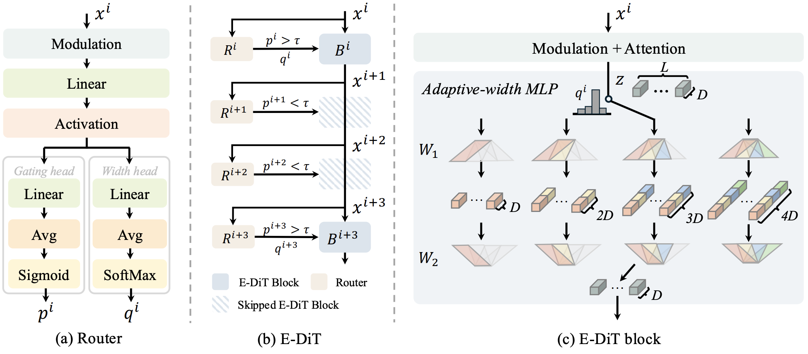
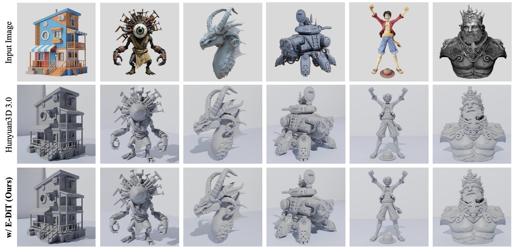
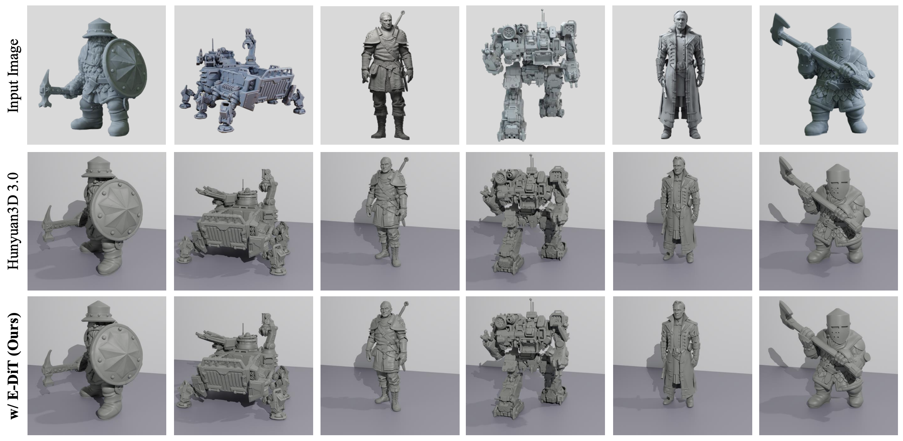

<div align="center">
  
# Elastic Diffusion Transformer

[Jiangshan Wang](https://scholar.google.com/citations?user=HoKoCv0AAAAJ&hl=en)<sup>1,2</sup>, 
[Zeqiang Lai](https://zeqiang-lai.github.io/)<sup>2,3†</sup>, 
[Jiarui Chen](https://scholar.google.com/citations?user=-kyuyBYAAAAJ&hl=zh-CN)<sup>2,4</sup>, 
[Jiayi Guo](https://www.jiayiguo.net)<sup>1</sup>, <br> 
[Hang Guo](https://csguoh.github.io/)<sup>1</sup>, 
[Xiu Li](https://scholar.google.com/citations?user=Xrh1OIUAAAAJ&hl=en&oi=ao)<sup>1</sup>, 
[Xiangyu Yue](https://xyue.io/)<sup>3*</sup>, 
[Chunchao Guo](https://dblp.org/pid/207/7888.html)<sup>2*</sup>

<sup>1</sup> Tsinghua University,  <sup>2</sup> Tencent Hunyuan,  <sup>3</sup> CUHK MMLab,  <sup>4</sup> HITSZ  

<sup>†</sup> Project Lead  <sup>*</sup> Corresponding Author  

[](https://arxiv.org/abs/2602.13993)
</div>


<p>
Diffusion Transformers (DiT) have demonstrated remarkable generative capabilities but remain highly computationally expensive. Previous acceleration methods, such as pruning and distillation, typically rely on a fixed computational capacity, leading to insufficient acceleration and degraded generation quality. To address this limitation, we propose <strong> Elastic Diffusion Transformer (E-DiT) </strong> , an adaptive acceleration framework for DiT that effectively improves efficiency while maintaining generation quality. Specifically, we observe that the generative process of DiT exhibits substantial sparsity (i.e., some computations can be skipped with minimal impact on quality), and this sparsity varies significantly across samples. Motivated by this observation, E-DiT equips each DiT block with a lightweight router that dynamically identifies sample-dependent sparsity from the input latent. Each router adaptively determines whether the corresponding block can be skipped. If the block is not skipped, the router then predicts the optimal MLP width reduction ratio within the block. During inference, we further introduce a block-level feature caching mechanism that leverages router predictions to eliminate redundant computations in a training-free manner. Extensive experiments across 2D image (Qwen-Image and FLUX) and 3D asset (Hunyuan3D-3.0) demonstrate the effectiveness of E-DiT, achieving up to ∼2× speedup with negligible loss in generation quality.
</p>


<p align="center">

</p>

# 🔥 News
- [2026.2.25] Inference code for image generation is released!
- [2026.2.15] Paper released!


# 💻 Code

## 🛠️ Setup

- Running the following command to construct the environment. We use the DiffSynth-Studio as the codebase to develop E-DiT, you can also refer to their [official repo](https://github.com/modelscope/DiffSynth-Studio) if there is any problem about the environment.
```
git clone https://github.com/wangjiangshan0725/Elastic-DiT.git 
cd Elastic-DiT
pip install -e .
```

- Download the weight of Qwen-Image from their official [Huggingface Repo](https://huggingface.co/Qwen/Qwen-Image/tree/main) and put them at <strong>ckpt/Qwen-Image</strong>; 

- Download the weight of E-DiT [here](https://huggingface.co/wjs0725/Elastic-DiT) and put it at <strong>ckpt/model.safetensors</strong>

## 🚀 Inference
```
python infer.py
```

# 🎨 Gallery


## Image Generation

<p align="center">

</p>
<p align="center">

</p>

## 3D Asset Generation

<p align="center">

</p>
<p align="center">

</p>


# 🖋️ Citation

If you find our work helpful, please **star 🌟** this repo and **cite 📑** our paper. Thanks for your support!

```
@article{wang2026elastic,
  title={Elastic Diffusion Transformer},
  author={Wang, Jiangshan and Lai, Zeqiang and Chen, Jiarui and Guo, Jiayi and Guo, Hang and Li, Xiu and Yue, Xiangyu and Guo, Chunchao},
  journal={arXiv preprint arXiv:2602.13993},
  year={2026}
}
```

# Acknowledgements
We thank [Qwen-Image](https://github.com/QwenLM/Qwen-Image) and [DiffSynth-Studio](https://github.com/modelscope/DiffSynth-Studio/tree/main) for their clean codebase.

# Contact
The code in this repository is still being reorganized. Errors that may arise during the organizing process could lead to code malfunctions or discrepancies from the original research results. If you have any questions or concerns, please send emails to wjs23@mails.tsinghua.edu.cn.
